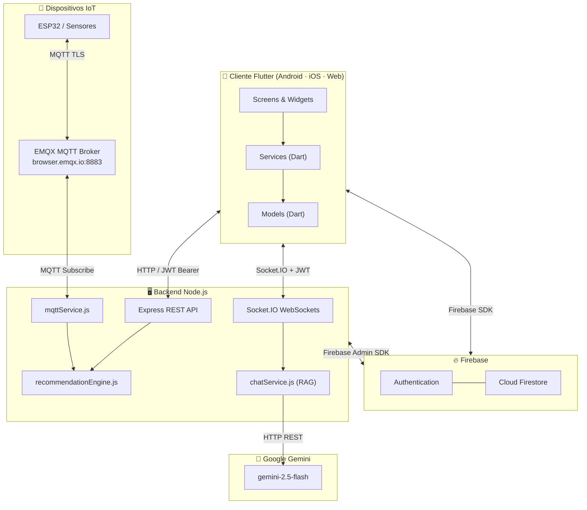
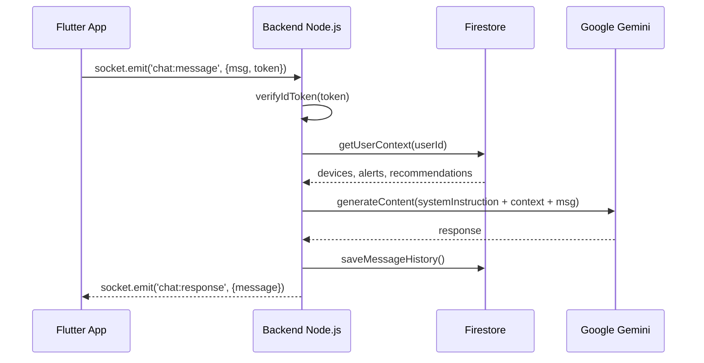

<div align="center">


# ⚡ GridWise

### Plataforma Inteligente de Monitoreo y Gestión Energética

[](https://flutter.dev)
[](https://dart.dev)
[](https://nodejs.org)
[](https://firebase.google.com)
[](https://ai.google.dev)
[](https://mqtt.org)

[](https://developer.android.com)
[](https://developer.apple.com)
[](https://flutter.dev/web)
[](LICENSE)
[](CONTRIBUTING.md)

---

*Monitorea, analiza y optimiza el consumo energético de tus dispositivos IoT con el poder de la Inteligencia Artificial.*

**[Ver Manual de Usuario](docs/manual_usuario_completo.md) · [Manual del Desarrollador](docs/manual_desarrollador.md) · [Reportar un Bug](https://github.com/fredy200104/GRIDWISE/issues) · [Solicitar Feature](https://github.com/fredy200104/GRIDWISE/issues)**

</div>

---

## 📋 Tabla de Contenidos

- [¿Qué es GridWise?](#-qué-es-gridwise)
- [Características Principales](#-características-principales)
- [Arquitectura del Sistema](#-arquitectura-del-sistema)
- [Stack Tecnológico](#-stack-tecnológico)
- [Estructura del Proyecto](#-estructura-del-proyecto)
- [Requisitos Previos](#-requisitos-previos)
- [Instalación Rápida](#-instalación-rápida)
  - [1. Backend Node.js](#1-backend-nodejs)
  - [2. App Flutter](#2-app-flutter)
  - [3. Configuración de Firebase](#3-configuración-de-firebase)
- [Variables de Entorno](#-variables-de-entorno)
- [Compilación para Producción](#-compilación-para-producción)
  - [Android (APK / AAB)](#android-apk--aab)
  - [iOS (App Store)](#ios-app-store)
- [Pantallas de la Aplicación](#-pantallas-de-la-aplicación)
- [Módulo de IA — GridWise Assistant](#-módulo-de-ia--gridwise-assistant)
- [Integración IoT y MQTT](#-integración-iot-y-mqtt)
- [Seguridad y Reglas de Firestore](#-seguridad-y-reglas-de-firestore)
- [Tests](#-tests)
- [Contribución](#-contribución)
- [Licencia](#-licencia)

---

## 🌟 ¿Qué es GridWise?

**GridWise** es una aplicación móvil y web **multiplataforma** desarrollada con **Flutter** que permite a los usuarios monitorear en tiempo real el consumo energético de sus dispositivos IoT. La plataforma integra un **asistente de inteligencia artificial** (*GridWise Assistant*, impulsado por Google Gemini 2.5 Flash) que analiza el contexto de consumo del usuario para ofrecer:

- 📊 **Monitoreo en tiempo real** del consumo energético (kWh, watts, COP)
- 🤖 **Recomendaciones inteligentes** generadas por IA con contexto real (RAG)
- ⚡ **Alertas automáticas** cuando se superan umbrales configurables
- 🔌 **Integración IoT** con dispositivos físicos vía protocolo MQTT (ESP32)
- 📈 **Reportes detallados** diarios, semanales y mensuales
- 💬 **Chat conversacional** con el asistente de IA con historial persistente

---

## ✨ Características Principales

| Categoría | Característica | Estado |
|-----------|----------------|--------|
| 🏠 Dashboard | Resumen en tiempo real — consumo total, dispositivos activos, alertas | ✅ Listo |
| 📱 Dispositivos IoT | Registro, edición y monitoreo con consumo en watts | ✅ Listo |
| 📊 Consumo | Gráficos históricos por dispositivo y por período (fl_chart) | ✅ Listo |
| 📋 Reportes | Generación y exportación de reportes energéticos detallados | ✅ Listo |
| 🔔 Alertas | Sistema de alertas automáticas con umbrales configurables | ✅ Listo |
| 💡 Recomendaciones | Sugerencias de ahorro por reglas + IA (prioridad alta/media/baja) | ✅ Listo |
| 🤖 Chat IA | Asistente conversacional con contexto de consumo real-time (RAG) | ✅ Listo |
| 🔌 MQTT / IoT | Conexión directa con dispositivos físicos vía MQTT TLS | ✅ Listo |
| 👤 Perfil | Gestión de cuenta con foto de perfil, tarifa y preferencias | ✅ Listo |
| 🔐 Autenticación | Email/Password + Google OAuth 2.0 + Recuperación de contraseña | ✅ Listo |

---

## 🏗️ Arquitectura del Sistema



---

## 🛠️ Stack Tecnológico

### Frontend — Flutter

| Paquete | Versión | Propósito |
|---------|---------|-----------|
| `flutter` | SDK | Framework UI multiplataforma |
| `firebase_core` | ^4.5.0 | Inicialización de Firebase |
| `firebase_auth` | ^6.2.0 | Autenticación de usuarios |
| `cloud_firestore` | ^6.1.3 | Base de datos NoSQL en tiempo real |
| `google_sign_in` | ^6.2.1 | OAuth 2.0 con Google |
| `fl_chart` | ^0.69.0 | Gráficos de consumo (línea y barras) |
| `socket_io_client` | ^3.1.4 | WebSocket con el backend (Chat IA) |
| `http` | ^1.5.0 | Peticiones REST al backend |
| `google_fonts` | ^8.0.2 | Tipografía Inter |
| `shimmer` | ^3.0.0 | Efecto skeleton de carga |
| `image_picker` | ^1.1.2 | Selección de foto de perfil |
| `cached_network_image` | ^3.4.1 | Caché de imágenes de red |
| `share_plus` | ^10.0.2 | Compartir reportes |
| `screenshot` | ^3.0.0 | Captura de reportes como imagen |
| `intl` | ^0.19.0 | Fechas, moneda y localización |
| `uuid` | ^4.4.2 | Generación de IDs únicos |

### Backend — Node.js

| Paquete | Versión | Propósito |
|---------|---------|-----------|
| `express` | ^5.2.1 | Framework HTTP REST |
| `socket.io` | ^4.8.3 | WebSockets en tiempo real |
| `@google/genai` | ^2.2.0 | SDK de Google Gemini AI |
| `firebase-admin` | ^13.8.0 | Admin SDK para Firestore + Auth |
| `mqtt` | ^5.15.1 | Cliente MQTT para dispositivos IoT |
| `dotenv` | ^17.4.2 | Variables de entorno |
| `cors` | ^2.8.6 | Control de acceso CORS |

---

## 📁 Estructura del Proyecto

```
gridwise/
├── lib/                                # Código fuente Flutter
│   ├── main.dart                       # Entrypoint: Firebase init, AuthGate, routing
│   ├── firebase_options.dart           # Config Firebase (auto-generado por FlutterFire)
│   │
│   ├── models/                         # Modelos de datos (Dart)
│   │   ├── alert_model.dart            # AlertModel + enums de severidad
│   │   ├── chat_message.dart           # Modelo de mensajes del chat IA
│   │   ├── device.dart                 # Modelo base de dispositivo
│   │   ├── device_model.dart           # DeviceModel completo + DeviceTypes
│   │   └── user_model.dart             # UserModel con preferencias y tarifa
│   │
│   ├── screens/                        # Pantallas de la aplicación (15 screens)
│   │   ├── welcome_screen.dart         # Splash/bienvenida con animación
│   │   ├── login_screen.dart           # Login Email + Google OAuth
│   │   ├── register_screen.dart        # Registro de cuenta nueva
│   │   ├── forgot_password_screen.dart # Recuperación de contraseña
│   │   ├── home_screen.dart            # Shell con NavigationBar (5 tabs)
│   │   ├── consumption_screen.dart     # Dashboard con métricas en tiempo real
│   │   ├── devices_screen.dart         # CRUD de dispositivos
│   │   ├── add_device_screen.dart      # Formulario agregar dispositivo
│   │   ├── edit_device_screen.dart     # Formulario editar dispositivo
│   │   ├── iot_connect_screen.dart     # Panel IoT / ESP32 / MQTT
│   │   ├── reports_screen.dart         # Reportes diario/semanal/mensual
│   │   ├── alerts_screen.dart          # Centro de alertas y notificaciones
│   │   ├── recommendations_screen.dart # Sugerencias de ahorro
│   │   ├── chat_screen.dart            # Chat con GridWise Assistant (IA)
│   │   ├── profile_screen.dart         # Perfil, tarifa y configuración
│   │   └── privacy_policy_screen.dart  # Política de privacidad
│   │
│   ├── services/                       # Lógica de negocio (Dart)
│   │   ├── service_auth.dart           # AuthService (email, Google, reset)
│   │   ├── user_service.dart           # CRUD perfil + preferencias Firestore
│   │   ├── device_service.dart         # CRUD dispositivos Firestore
│   │   ├── dashboard_service.dart      # Stream reactivo del dashboard
│   │   ├── alert_service.dart          # Alertas en tiempo real
│   │   ├── iot_service.dart            # Comunicación HTTP con backend IoT
│   │   ├── recommendation_service.dart # Recomendaciones del motor de reglas
│   │   └── chat_service.dart           # WebSocket con backend (Socket.IO)
│   │
│   └── widgets/                        # Widgets reutilizables
│       ├── energy_card.dart            # Tarjeta de métrica energética
│       ├── device_card.dart            # Tarjeta de dispositivo
│       └── dashboard_skeleton.dart     # Shimmer de carga del dashboard
│
├── gridwise-backend/                   # Servidor Node.js
│   ├── server.js                       # Entrypoint Express + Socket.IO + JWT
│   ├── apiRoutes.js                    # REST: /api/consumption, /api/devices
│   ├── chatRoutes.js                   # REST: /api/chat/history
│   ├── chatService.js                  # Motor IA: Gemini + RAG Firestore
│   ├── mqttService.js                  # Cliente MQTT + procesamiento IoT
│   ├── recommendationEngine.js         # Motor de reglas de ahorro
│   ├── firebaseAdmin.js                # Firebase Admin SDK init
│   ├── .env.example                    # Plantilla de variables de entorno
│   └── package.json                    # Dependencias npm
│
├── android/                            # Plataforma Android
│   └── app/
│       ├── build.gradle.kts            # Config: minSdk=23, namespace=com.gridwise.app
│       └── google-services.json        # Config Firebase Android
│
├── ios/                                # Plataforma iOS
│   ├── Podfile                         # CocoaPods: iOS 13.0+, EXCLUDED_ARCHS M1
│   └── Runner/
│       ├── GoogleService-Info.plist    # Config Firebase iOS
│       └── Info.plist                  # Permisos y metadata de la app
│
├── assets/
│   └── images/
│       └── google_logo.png             # Logo Google para botón de login
│
├── docs/                               # Documentación
│   ├── manual_usuario_completo.md      # Manual de usuario
│   ├── manual_desarrollador.md         # Manual del desarrollador
│   ├── esp32_firmware.md               # Guía de firmware ESP32
│   ├── reporte_pruebas_tecnicas.md     # Reporte de pruebas técnicas
│   └── protocolos_seguridad.md         # Protocolos de seguridad
│
├── firestore.rules                     # Reglas de seguridad Firestore
├── firebase.json                       # Config Firebase CLI
├── pubspec.yaml                        # Dependencias Flutter
├── CONTRIBUTING.md                     # Guía de contribución
├── CHANGELOG.md                        # Historial de versiones
├── SECURITY.md                         # Política de seguridad
└── README.md                           # Este archivo
```

---

## 📦 Requisitos Previos

Asegúrate de tener instalado **antes de empezar**:

| Herramienta | Versión Mínima | Enlace |
|-------------|---------------|--------|
| Flutter SDK | ≥ 3.11.1 | [flutter.dev/get-started](https://docs.flutter.dev/get-started/install) |
| Dart SDK | ^3.11.1 | Incluido con Flutter |
| Node.js + npm | ≥ 18.x | [nodejs.org](https://nodejs.org) |
| Firebase CLI | Última | `npm install -g firebase-tools` |
| Git | ≥ 2.x | [git-scm.com](https://git-scm.com) |

**Cuentas y servicios requeridos:**
- 🔥 **Firebase** — [console.firebase.google.com](https://console.firebase.google.com)
- 🤖 **Google Gemini API Key** — [aistudio.google.com](https://aistudio.google.com)
- 📡 **Broker MQTT** — [EMQX Cloud](https://www.emqx.com/en/cloud) (gratuito) o Mosquitto propio

**Para compilar iOS** (adicional):
- macOS con Xcode ≥ 15
- CocoaPods: `sudo gem install cocoapods`
- Cuenta de Apple Developer

---

## 🚀 Instalación Rápida

### 1. Backend Node.js

```bash
# Clonar el repositorio
git clone https://github.com/fredy200104/GRIDWISE.git
cd GRIDWISE/gridwise-backend

# Instalar dependencias
npm install

# Crear el archivo de variables de entorno
cp .env.example .env
# ⚠️ Editar .env con tus credenciales (ver sección Variables de Entorno)

# Iniciar en modo desarrollo (con auto-reload)
npm run dev

# Iniciar en producción
npm start
```

El servidor quedará disponible en `http://localhost:3000`.  
Verifica el estado en: `GET http://localhost:3000/health`

### 2. App Flutter

```bash
# Desde la raíz del proyecto
cd GRIDWISE

# Obtener dependencias de Flutter
flutter pub get

# Verificar configuración del entorno
flutter doctor -v

# ▶️ Ejecutar en modo debug
flutter run                    # Selecciona dispositivo conectado
flutter run -d chrome          # Modo web (Chrome)
flutter run -d emulator-5554   # Emulador Android específico

# Listar dispositivos disponibles
flutter devices
```

> **Nota:** En modo debug, la app intentará conectarse al backend en `localhost:3000` (web), `10.0.2.2:3000` (emulador Android) o la IP de tu máquina de desarrollo (dispositivo físico).

### 3. Configuración de Firebase

1. Crea un proyecto en [Firebase Console](https://console.firebase.google.com).
2. Habilita **Authentication** → Proveedores: `Email/Password` y `Google`.
3. Crea una base de datos **Firestore** en modo producción.
4. Descarga y coloca los archivos de configuración:
   - `google-services.json` → `android/app/`
   - `GoogleService-Info.plist` → `ios/Runner/`
5. Ejecuta el configurador automático:
   ```bash
   dart pub global activate flutterfire_cli
   flutterfire configure
   ```
   Esto genera automáticamente `lib/firebase_options.dart`.

6. Para el backend, descarga la **clave de cuenta de servicio**:
   - Firebase Console → ⚙️ Configuración → Cuentas de servicio → **Generar nueva clave privada**
   - Guarda como `gridwise-backend/serviceAccountKey.json`

> [!CAUTION]
> **NUNCA** subas `serviceAccountKey.json`, `.env` ni archivos `.keystore` al repositorio. Ya están protegidos en `.gitignore`.

---

## 🔐 Variables de Entorno

Crea `gridwise-backend/.env` basándote en `.env.example`:

```env
# ── Servidor ──────────────────────────────────────────
PORT=3000
NODE_ENV=development

# ── Google Gemini AI ──────────────────────────────────
GEMINI_API_KEY=tu_api_key_de_gemini_aqui

# ── Firebase Admin SDK ────────────────────────────────
FIREBASE_SERVICE_ACCOUNT_PATH=./serviceAccountKey.json

# ── Broker MQTT (EMQX Cloud o propio) ─────────────────
MQTT_BROKER_URL=mqtts://broker.emqx.io:8883
MQTT_USERNAME=tu_usuario_mqtt
MQTT_PASSWORD=tu_password_mqtt
MQTT_TOPIC=gridwise/devices/#

# ── CORS ──────────────────────────────────────────────
ALLOWED_ORIGINS=http://localhost:3000,http://localhost:8080
```

| Variable | Descripción | Requerida |
|----------|-------------|-----------|
| `PORT` | Puerto del servidor (default: 3000) | No |
| `GEMINI_API_KEY` | API Key de Google AI Studio | **Sí** |
| `FIREBASE_SERVICE_ACCOUNT_PATH` | Ruta al archivo de credenciales Firebase | **Sí** |
| `MQTT_BROKER_URL` | URL del broker MQTT | **Sí** |
| `MQTT_USERNAME` | Usuario MQTT | Depende del broker |
| `MQTT_PASSWORD` | Contraseña MQTT | Depende del broker |
| `ALLOWED_ORIGINS` | Orígenes CORS permitidos | No |

---

## 📦 Compilación para Producción

### Android (APK / AAB)

#### 1. Crear el Keystore de firma

```bash
# Generar el keystore (guarda la contraseña de forma segura)
keytool -genkey -v -keystore gridwise-release.jks \
  -keyalg RSA -keysize 2048 -validity 10000 \
  -alias gridwise-key
```

#### 2. Configurar la firma en Android

Crea el archivo `android/key.properties` (está en `.gitignore`, nunca lo subas):

```properties
storePassword=<tu-contraseña-del-keystore>
keyPassword=<tu-contraseña-de-la-clave>
keyAlias=gridwise-key
storeFile=<ruta-absoluta>/gridwise-release.jks
```

Actualiza `android/app/build.gradle.kts` para usar la firma en release:

```kotlin
// Añadir antes del bloque android {}
val keyProperties = Properties()
val keyPropertiesFile = rootProject.file("key.properties")
if (keyPropertiesFile.exists()) {
    keyProperties.load(FileInputStream(keyPropertiesFile))
}

android {
    // ...
    signingConfigs {
        create("release") {
            keyAlias = keyProperties["keyAlias"] as String
            keyPassword = keyProperties["keyPassword"] as String
            storeFile = file(keyProperties["storeFile"] as String)
            storePassword = keyProperties["storePassword"] as String
        }
    }
    buildTypes {
        release {
            signingConfig = signingConfigs.getByName("release")
        }
    }
}
```

#### 3. Compilar

```bash
# APK universal (para distribución directa)
flutter build apk --release

# App Bundle (recomendado para Google Play Store)
flutter build appbundle --release

# APK por arquitectura (menor tamaño)
flutter build apk --split-per-abi --release
```

Los artefactos quedan en:
- APK: `build/app/outputs/flutter-apk/app-release.apk`
- AAB: `build/app/outputs/bundle/release/app-release.aab`

---

### iOS (App Store)

> ⚠️ **Requiere macOS con Xcode instalado.**

```bash
# 1. Instalar pods (solo la primera vez o al agregar dependencias)
cd ios && pod install && cd ..

# 2. Compilar para release
flutter build ios --release

# 3. Abrir en Xcode para firma y distribución
open ios/Runner.xcworkspace
```

**En Xcode:**
1. Selecciona el target `Runner`
2. En `Signing & Capabilities` → Configura tu **Team** y **Bundle Identifier** (`com.gridwise.app`)
3. Selecciona el dispositivo: `Any iOS Device (arm64)`
4. **Product → Archive** para crear el archivo para distribución
5. En **Organizer → Distribute App** → selecciona **App Store Connect**

**Requisitos adicionales iOS:**
- Bundle ID: `com.gridwise.app` (registrar en [developer.apple.com](https://developer.apple.com))
- Provisioning Profile de distribución
- Certificado de distribución de Apple

---

## 🖥️ Pantallas de la Aplicación

| Pantalla | Archivo | Descripción |
|----------|---------|-------------|
| 🏠 Bienvenida | `welcome_screen.dart` | Splash con animaciones de entrada y opciones de acceso |
| 🔑 Login | `login_screen.dart` | Inicio de sesión con Email/Google OAuth |
| 📝 Registro | `register_screen.dart` | Creación de cuenta nueva |
| 🔒 Recuperar Contraseña | `forgot_password_screen.dart` | Envío de email de recuperación |
| 📊 Dashboard | `consumption_screen.dart` | Panel principal con métricas en tiempo real |
| 📱 Dispositivos | `devices_screen.dart` | Lista y gestión de dispositivos registrados |
| ➕ Agregar Dispositivo | `add_device_screen.dart` | Formulario para registrar nuevo dispositivo |
| ✏️ Editar Dispositivo | `edit_device_screen.dart` | Modificar datos de un dispositivo existente |
| 🔌 Conectar IoT | `iot_connect_screen.dart` | Vincular dispositivos físicos vía MQTT/ESP32 |
| 📈 Consumo | `reports_screen.dart` | Gráficos históricos diario/semanal/mensual |
| 🔔 Alertas | `alerts_screen.dart` | Centro de alertas y notificaciones de consumo |
| 💡 Recomendaciones | `recommendations_screen.dart` | Sugerencias de ahorro por IA y reglas |
| 🤖 Chat IA | `chat_screen.dart` | Chat con GridWise Assistant (Gemini AI) |
| 👤 Perfil | `profile_screen.dart` | Gestión de perfil, tarifa y configuración |
| 📜 Privacidad | `privacy_policy_screen.dart` | Política de privacidad |

---

## 🤖 Módulo de IA — GridWise Assistant

GridWise Assistant es el asistente conversacional integrado, impulsado por **Google Gemini 2.5 Flash**. Su implementación combina capacidades de lenguaje natural con datos de consumo en tiempo real mediante la técnica **RAG (Retrieval-Augmented Generation)**.

### Flujo RAG — Contexto Dinámico

Antes de cada llamada a Gemini, el backend ejecuta `getUserContext(userId)` que consulta Firestore y extrae:

- ✅ Todos los dispositivos IoT activos del usuario
- ✅ Consumo instantáneo en watts (`last_power_watts`)
- ✅ Estado de conexión de cada dispositivo
- ✅ Alertas y recomendaciones pendientes

Esta información se inyecta dinámicamente al `systemInstruction` de Gemini, permitiéndole responder con datos reales del usuario en lugar de respuestas genéricas.

### Flujo de Comunicación



### Detección Automática de Entorno

La app detecta dinámicamente el entorno para conectar al backend:

| Entorno | URL del Backend |
|---------|----------------|
| 🌐 Web (Chrome) | `http://localhost:3000` |
| 📱 Emulador Android | `http://10.0.2.2:3000` |
| 📲 Dispositivo físico | `http://<IP-local-de-tu-PC>:3000` |

---

## 🔌 Integración IoT y MQTT

GridWise se conecta con dispositivos físicos a través del protocolo **MQTT sobre TLS**:

### Topics MQTT

| Topic | Dirección | Descripción |
|-------|-----------|-------------|
| `home/{userId}/{deviceId}/data` | ESP32 → Servidor | Datos de consumo en tiempo real |
| `home/{userId}/{deviceId}/commands` | Servidor → ESP32 | Comandos de control |

### Payload esperado del ESP32

```json
{
  "device_token": "abc123def456...",
  "instant_power_watts": 1200.5,
  "standby_watts": 15.0,
  "voltage": 120.0,
  "current_amps": 10.0
}
```

### Motor de Recomendaciones

El `recommendationEngine.js` evalúa los datos recibidos con estas reglas:

| Regla | Condición | Prioridad |
|-------|-----------|-----------|
| `rule_high_instant_power` | Potencia instantánea > 1800W | 🔴 Alta |
| `rule_standby_drain` | Consumo en espera ≥ 80W | 🟡 Media |
| `rule_monthly_projection` | Proyección mensual > umbral configurado | 🔴 Alta |

---

## 🛡️ Seguridad y Reglas de Firestore

Las reglas en `firestore.rules` garantizan **aislamiento total entre usuarios**:

```
/users/{uid}/**              → Solo el propietario (request.auth.uid == uid)
  /devices/{deviceId}        → Solo el propietario
  /alerts/{alertId}          → Solo el propietario
  /consumption_records/      → Solo el propietario
  /iot_devices/              → Solo el propietario

/recommendations/{docId}     → Lectura/escritura si resource.data.user_id == auth.uid
/device_data_unified/{id}    → Lectura si resource.data.user_id == auth.uid
/iot_devices/{deviceId}      → Escritura solo desde el backend (Admin SDK)
```

**Medidas de seguridad adicionales:**
- 🔐 Validación de Firebase JWT en cada request HTTP al backend
- 🔄 Renovación forzada del token (`getIdToken(true)`) antes de cada conexión Socket.IO
- 🔑 Tokens de dispositivos IoT almacenados como hash SHA-256 (nunca en texto plano)
- 🚫 Archivos sensibles excluidos del repositorio vía `.gitignore`

---

## 🧪 Tests

```bash
# Ejecutar todos los tests
flutter test

# Test específico
flutter test test/device_model_test.dart

# Análisis estático de código
flutter analyze

# Verificar formato de código
dart format --output=none --set-exit-if-changed lib/
```

**Cobertura actual de tests (v1.0.0):**
- ✅ `device_model_test.dart` — Cálculo de consumo y costo (kWh, COP)
- ✅ `recommendation_service_test.dart` — Reglas de alertas y consumo fantasma (2 casos)
- ✅ `widget_test.dart` — Smoke test de componentes clave

---

## 🤝 Contribución

¡Las contribuciones son bienvenidas! Por favor lee la [Guía de Contribución](CONTRIBUTING.md) antes de comenzar.

```bash
# 1. Fork del repositorio en GitHub
# 2. Clonar tu fork
git clone https://github.com/TU_USUARIO/GRIDWISE.git

# 3. Crear rama para tu feature
git checkout -b feature/mi-nueva-funcionalidad

# 4. Realizar cambios y commit (Conventional Commits)
git commit -m "feat: agrega soporte para sensor de temperatura"

# 5. Push a tu fork
git push origin feature/mi-nueva-funcionalidad

# 6. Abrir un Pull Request en GitHub
```

Consulta también:
- 📋 [Código de Conducta](CODE_OF_CONDUCT.md)
- 🔐 [Política de Seguridad](SECURITY.md)
- 📝 [Changelog](CHANGELOG.md)

---

## 📄 Licencia

Este proyecto está bajo la Licencia **MIT**. Ver [LICENSE](LICENSE) para más detalles.

---

<div align="center">

**⚡ GridWise — Energía Inteligente para un Futuro Sostenible ⚡**

Desarrollado con ❤️ usando Flutter · Node.js · Firebase · Google Gemini AI

[](https://github.com/fredy200104/GRIDWISE)
[](https://github.com/fredy200104/GRIDWISE/fork)

</div>
