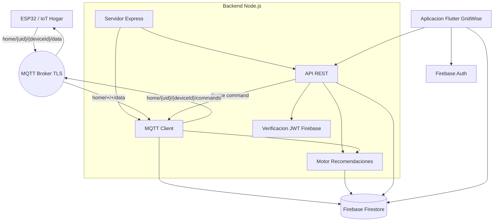

# Arquitectura del Sistema GridWise Residencial

```mermaid
graph TD
    HomeIoT[ESP32 / IoT Hogar]
    MQTT((MQTT Broker TLS))

    subgraph backend [Backend Node.js]
        Server[Servidor Express]
        API[API REST]
        Engine[Motor Recomendaciones]
        MQTTService[MQTT Client]
        AuthVerify[Verificacion JWT Firebase]

        Server --> API
        API --> AuthVerify
        API --> Engine
        Server --> MQTTService
        MQTTService --> Engine
    end

    Firestore[(Firebase Firestore)]
    Auth[Firebase Auth]
    App[Aplicacion Flutter GridWise]

    HomeIoT -- "home/{uid}/{deviceId}/data" --> MQTT
    MQTT -- "home/+/+/data" --> MQTTService

    MQTTService --> Firestore
    Engine --> Firestore
    API --> Firestore

    App --> Auth
    App --> Firestore
    App --> API

    API -- "device command" --> MQTTService
    MQTTService -- "home/{uid}/{deviceId}/commands" --> MQTT
    MQTT --> HomeIoT
```
